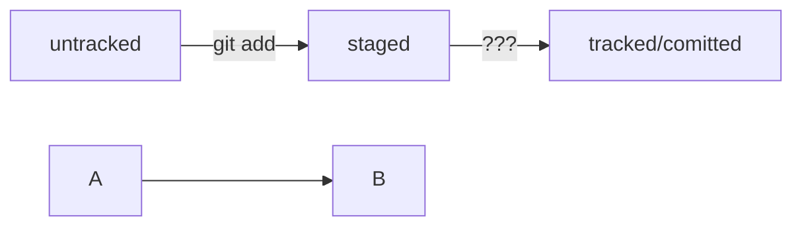

#TESTING project

---

1. test
2. test

* test
* test

~~unread~~

*test*

[link](https://2ip.com "link111")

###end

```mermaid
graph LR;
  untracked -- "git add" --> staged;
  staged    -- "???"     --> tracked/comitted;

%% стрелка без текста для примера: 
  A --> B;
```
